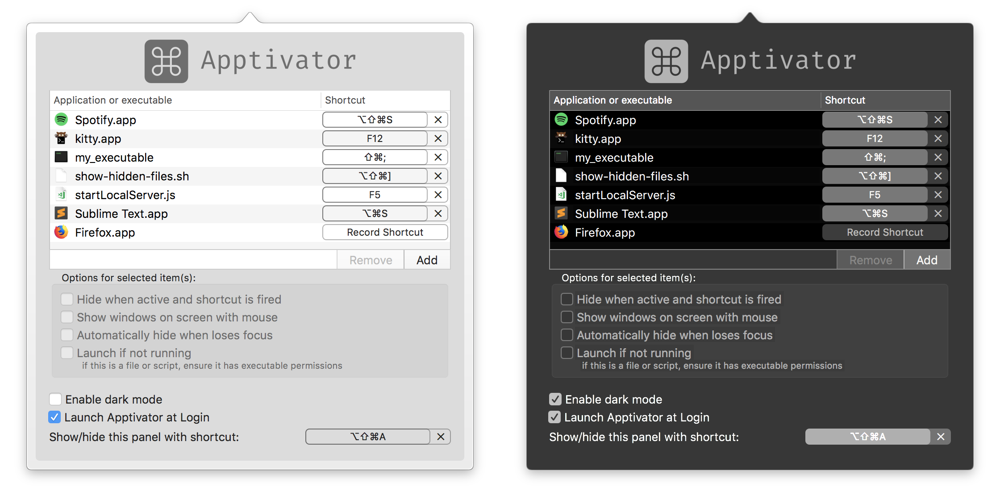

With Apptivator, you can create global hotkeys that will activate chosen apps (or scripts/anything executable) with predefined shortcuts. This means you can have a shortcut to show/hide/execute any application at any time!

I created this because I liked iTerm2's concept of a "hotkey" window, and I wanted to try alacritty/kitty as my main terminal for a while and found I couldn't live without a window I could activate at any time. So, I created this in order to have a global hotkey to activate/deactivate kitty (and any other apps) at the touch of a button.

It's also sometimes useful to run a script easily via a keyboard shortcut (or sequence of shortcuts).

## Installation

Simply download the dmg from the [releases](https://github.com/acheronfail/apptivator/releases) tab and drag Apptivator.app into your `/Applications` folder.



## Usage

It's simple really. Once Apptivator is running you'll see an icon in your menubar - click it to configure Apptivator. You can open the shortcuts window by clicking on the icon and choosing it from the menu.

In the menu, select an application (or executable) from the Finder (or optionally choose from running applications) and register a sequence for it. From now on (as long as Apptivator is enabled) you can activate that application via the sequence you set for it.

#### Shortcut Sequences

Apptivator uses something called a "shortcut sequence" to define hotkeys. This means that you can define a sequence of shortcuts (minimum 1) to activate your application. So if you set the sequence to <kbd>⇧⌘A</kbd> + <kbd>^B</kbd>, to activate your application you would need to first press (and release) <kbd>⇧⌘A</kbd>, and then press <kbd>^B</kbd>.
Apptivator's icon will turn red if you're currently in a shortcut sequence.

#### Make apps appear on every space

If you want your applications to appear on every space, I recommend allowing the application to appear on all spaces. This can be done by clicking on the icon in the dock and selecting -> `Options` -> `All Desktops`.

### Options

Apptivator provides some neat options:

* **Automatically hide when app loses focus**
	- When enabled, if the application loses focus then Apptivator will automatically hide it for you.
* **Show on the screen with mouse**
	- When this is on, then when activated the application will show up on whichever monitor your mouse is on.
* **Hide when active and sequence is fired**
	- If this is set then when you complete the sequence the application will hide if it's shown, or be shown if it's hidden.
* **Launch app if it's not running**
	- When set, if the application is fired then Apptivator will attempt to launch it.
* **Launch Apptivator at login**
	- self-explanatory

#### Extra Overrides or Hidden Settings

Apptivator has some experimental overrides that can be toggled via the Terminal (`defaults write ...`, etc). Look under the "Experimental Overrides" section at `Apptivator` -> `About` for more information.

## Questions/Concerns

* **Nothing works, no shortcuts do anything**
	- Make sure that Apptivator is enabled! You can enable/disable it by right-clicking on the menu bar icon - you can see if Apptivator is off/on by left-clicking on the icon to show the menu. The first item in the menu will display whether Apptivator is on or off.
* **When I activate my app its window doesn't appear**
	- Set the application to appear on all spaces. This can be done by clicking on the icon in the dock and selecting -> `Options` -> `All Desktops` (see [#12](https://github.com/acheronfail/apptivator/issues/12#issuecomment-370787813) for a discussion and ways to automate this).
* **Activating my app always moves my computer to another space**
	- This won't happen if the `Options` -> `All Desktops` is set for the application.
	- The behaviour can be adjusted by going to `System Preferences` -> `Mission Control` -> and enabling/disabling the checkbox: `When switching to an application, switch to a Space with open windows for the application`
* **Apptivator doesn't run my executable/script**
	- Ensure that the file has execute permissions! Run `chmod +x path/to/file` to be sure.
* **Apptivator doesn't wait long enough for me to press every shortcut in the sequence**
	- You can easily increase the time Apptivator will wait between keypress in a shortcut sequence - this is an override that must be set via the terminal:
	- `defaults write com.acheronfail.apptivator sequentialShortcutDelay -float 1` sets the delay to 1 second. Look under the "Experimental Overrides" section at `Apptivator` -> `About` for more information.

## Developing

#### Requirements and dependencies

The app requires macOS 13 or later. Build with Xcode 26.3 or later.
Release builds are universal: the application and its dependencies contain both
`arm64` (Apple silicon) and `x86_64` (Intel) code. Replace the old Intel-only app
in `/Applications` with the new build to remove macOS's Intel-app support warning.

Dependencies are managed with Swift Package Manager; Sparkle supplies a universal binary framework. Open
`Apptivator.xcodeproj` and Xcode resolves them automatically; Carthage is no longer
needed. Commit `Apptivator.xcodeproj/project.xcworkspace/xcshareddata/swiftpm/Package.resolved`
when updating dependencies.

| Dependency | Version / revision | Migration |
| --- | --- | --- |
| [Sparkle](https://github.com/sparkle-project/Sparkle) | 2.9.6 | Signed automatic updates hosted on GitHub Releases |
| [SwiftyJSON](https://github.com/SwiftyJSON/SwiftyJSON) | 5.0.2 | Keeps the existing configuration JSON format |
| [AXSwift](https://github.com/tmandry/AXSwift) | 0.3.2 | Native source build for both architectures |
| [LaunchAtLogin Modern](https://github.com/sindresorhus/LaunchAtLogin-Modern) | 1.1.0 | Uses macOS's login-item service; removes the legacy helper app |
| [CleanroomLogger](https://github.com/emaloney/CleanroomLogger) | `d732baead85b77471505daf290212700b9d87a05` | Post-7.0.0 revision with a supported Swift package manifest; preserves rotating logs |
| [MASShortcut](https://github.com/shpakovski/MASShortcut) | `6f2603c6b6cc18f64a799e5d2c9d3bbc467c413a` | Post-2.4.0 revision with Swift package support; replaces the custom fork with a validator subclass |

MASShortcut and CleanroomLogger have no tagged release containing their current
Swift package manifests, so they use fixed upstream revisions. Dependencies and
GitHub Actions are pinned for reproducible builds. Third-party licenses are
included in the app's resources.

After upgrading, check **Launch Apptivator at Login** again if you used the old
login helper. macOS manages the new registration under System Settings → General
→ Login Items. The existing shortcut configuration stays at
`~/Library/Preferences/Apptivator/configuration.json`.

#### CI builds and packages

Builds and tests run in GitHub Actions. Master pushes and manual Build runs use
`scripts/with-code-signing-identity.sh ./scripts/build.sh`; tagged releases pass
the tag to that command. Pull-request builds use ad-hoc signatures and never
receive signing secrets. Configure the certificate secrets and Sparkle public key before running a
master or release build; see [Signing and releases](RELEASING.md).

Tests run on the host architecture and use temporary configuration and application
fixtures. The release script archives both architectures, verifies every Mach-O
binary and the app signature, and writes these files to `dist/`:

- `Apptivator-<version>-universal.dmg`
- `Apptivator-<version>-universal.zip`
- `Apptivator-<version>-universal-SHA256SUMS.txt`

Master and release builds use the same long-lived self-signed certificate and an
explicit designated requirement for `com.acheronfail.apptivator`, so updates keep
a stable identity for Accessibility permissions. The initial transition from an
older signature may require granting Accessibility access once more. Keep using
the same certificate and bundle identifier for subsequent updates.

This does not require Apple Developer Program membership, and it does not provide
Developer ID signing or notarization. Downloaded builds may still require approval
in System Settings → Privacy & Security. Debug symbols remain in the CI archive
but are not packaged or published.

#### Continuous integration and releases

The Build workflow runs on pushes and pull requests to `master`, and can also be
started manually. It runs tests on a GitHub-hosted Apple silicon Mac and uploads
the universal packages as workflow artifacts.

Push a tag matching `vX.Y.Z` to run the Release workflow, for example:

```bash
git tag v1.7.0
git push origin v1.7.0
```

The release job validates the tag, runs tests, builds fresh universal artifacts,
and creates a GitHub release with those artifacts attached. The tag sets
`CFBundleShortVersionString`; a shared time-based build number sets `CFBundleVersion`.
Only the release job has `contents: write` permission. It uses GitHub's automatic
`GITHUB_TOKEN` to publish the release. The certificate secrets and Sparkle signing configuration described in
[RELEASING.md](RELEASING.md) are required for publishing. The release also includes
a signed `appcast.xml`; Sparkle uses it to discover and verify updates. Install the
first Sparkle-enabled release manually, then use **Check for Updates…** from the
menu. Sparkle asks permission to check automatically.

## License

[GPLv3](./LICENSE)
