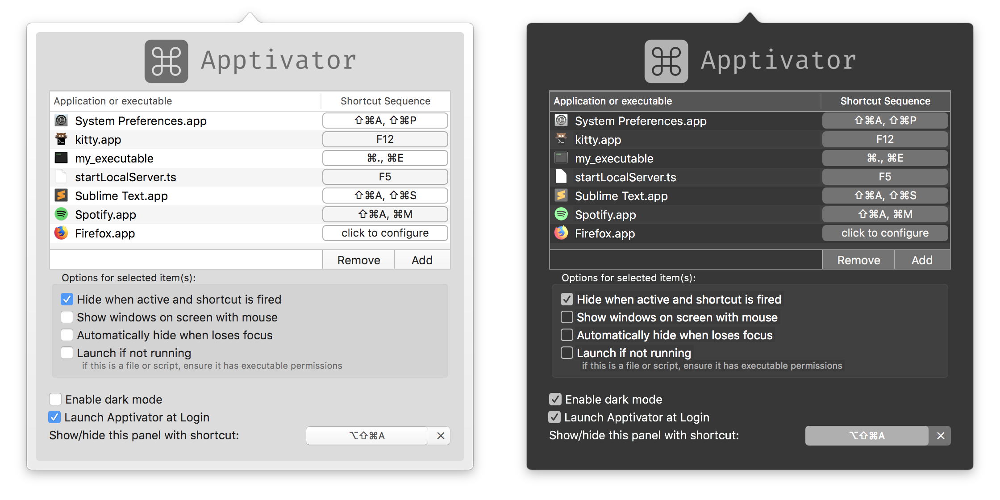

With Apptivator, you can create global hotkeys that will activate chosen apps (or scripts/anything executable) with predefined shortcuts. This means you can have a shortcut to show/hide/execute any application at any time!

I created this because I liked iTerm2's concept of a "hotkey" window, and I wanted to try alacritty/kitty as my main terminal for a while and found I couldn't live without a window I could activate at any time. So, I created this in order to have a global hotkey to activate/deactivate kitty (and any other apps) at the touch of a button.

It's also sometimes useful to run a script easily via a keyboard shortcut (or sequence of shortcuts).

## Installation

Simply download the dmg from the [releases](https://github.com/acheronfail/apptivator/releases) tab and drag Apptivator.app into your `/Applications` folder.



## Usage

It's simple really. Once Apptivator is running you'll see an icon in your menubar - click it to configure Apptivator. You can open the shortcuts window by clicking on the icon and choosing it from the menu.

In the menu, select an application (or executable) from the Finder (or optionally choose from running applications) and register a sequence for it. From now on (as long as Apptivator is enabled) you can activate that application via the sequence you set for it.

#### Shortcut Sequences

Apptivator uses something called a "shortcut sequence" to define hotkeys. This means that you can define a sequence of shortcuts (minimum 1) to activate your application. So if you set the sequence to <kbd>⇧⌘A</kbd> + <kbd>^B</kbd>, to activate your application you would need to first press (and release) <kbd>⇧⌘A</kbd>, and then press <kbd>^B</kbd>.
Apptivator's icon will turn red if you're currently in a shortcut sequence.

#### Make apps appear on every space

If you want your applications to appear on every space, I recommend allowing the application to appear on all spaces. This can be done by clicking on the icon in the dock and selecting -> `Options` -> `All Desktops`.

### Options

Apptivator provides some neat options:

* **Automatically hide when app loses focus**
	- When enabled, if the application loses focus then Apptivator will automatically hide it for you.
* **Show on the screen with mouse**
	- When this is on, then when activated the application will show up on whichever monitor your mouse is on.
* **Hide when active and sequence is fired**
	- If this is set then when you complete the sequence the application will hide if it's shown, or be shown if it's hidden.
* **Launch app if it's not running**
	- When set, if the application is fired then Apptivator will attempt to launch it.
* **Launch Apptivator at login**
	- self-explanatory

#### Extra Overrides or Hidden Settings

Apptivator has some experimental overrides that can be toggled via the Terminal (`defaults write ...`, etc). Look under the "Experimental Overrides" section at `Apptivator` -> `About` for more information.

## Questions/Concerns

* **Nothing works, no shortcuts do anything**
	- Make sure that Apptivator is enabled! You can enable/disable it by right-clicking on the menu bar icon - you can see if Apptivator is off/on by left-clicking on the icon to show the menu. The first item in the menu will display whether Apptivator is on or off.
* **When I activate my app its window doesn't appear**
	- Set the application to appear on all spaces. This can be done by clicking on the icon in the dock and selecting -> `Options` -> `All Desktops` (see [#12](https://github.com/acheronfail/apptivator/issues/12#issuecomment-370787813) for a discussion and ways to automate this).
* **Activating my app always moves my computer to another space**
	- This won't happen if the `Options` -> `All Desktops` is set for the application.
	- The behaviour can be adjusted by going to `System Preferences` -> `Mission Control` -> and enabling/disabling the checkbox: `When switching to an application, switch to a Space with open windows for the application`
* **Apptivator doesn't run my executable/script**
	- Ensure that the file has execute permissions! Run `chmod +x path/to/file` to be sure.
* **Apptivator doesn't wait long enough for me to press every shortcut in the sequence**
	- You can easily increase the time Apptivator will wait between keypress in a shortcut sequence - this is an override that must be set via the terminal:
	- `defaults write com.acheronfail.apptivator sequentialShortcutDelay -float 1` sets the delay to 1 second. Look under the "Experimental Overrides" section at `Apptivator` -> `About` for more information.

## Developing

#### Setting up the project

Apptivator uses `carthage` to manage its dependencies (you can install it with `brew`). To build Apptivator on your machine:

```bash
# Clone the repository
git clone git@github.com:acheronfail/apptivator.git && cd apptivator
# Install dependencies with carthage
carthage update --platform macos
# Open the project
open Apptivator.xcodeproj
```

Once you've opened the Xcode project, it should be enough to make your changes and then just hit the build/run button and go from there.

#### Creating a DMG

The process to create build artefacts for this app is extremely simple:

1. Archive a build in Xcode (`Products` -> `Archive`)
2. Export the app
3. Run [`create-dmg`](https://github.com/sindresorhus/create-dmg)
4. 🎉

## License

[MIT](./LICENSE)
